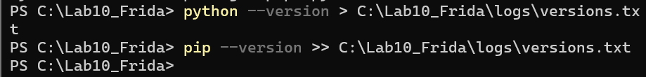
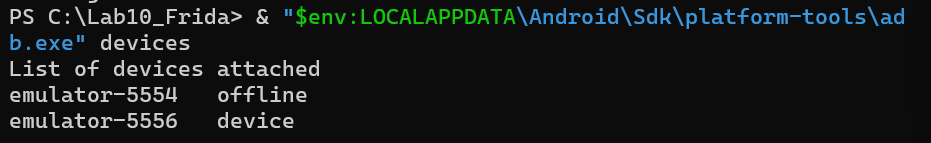
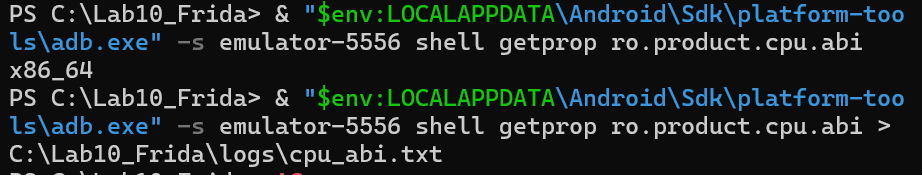
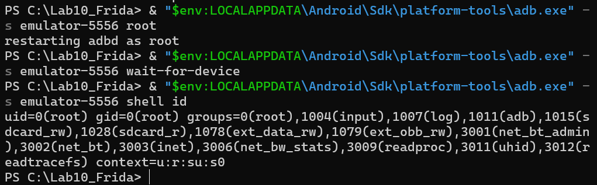
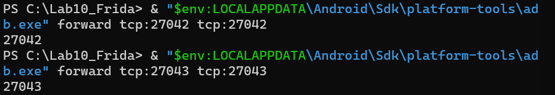

# LAB 10 — Mise en place et exploration de Frida sur Android

## 1. Vue d'ensemble

Ce laboratoire couvre la chaîne complète nécessaire pour instrumenter dynamiquement une application Android avec Frida : installation des outils côté poste de travail, déploiement du serveur sur l'émulateur, puis injection de scripts JavaScript pour observer le comportement en temps réel.

L'application cible est `projetws`, identifiée par le package `com.example.projetws`, exécutée sur un émulateur Android. L'approche retenue est l'**analyse dynamique** : l'application est lancée et observée en cours d'exécution, sans passer par la décompilation statique de l'APK.

---

## 2. Ce que couvre ce lab

- Mise en place de Frida et frida-tools sous Windows
- Contrôle de l'environnement Python/pip et validation de l'installation Frida
- Établissement de la communication ADB avec l'émulateur
- Détermination de l'architecture CPU de la cible
- Récupération et déploiement de la version adaptée de `frida-server`
- Lancement du serveur Frida sur Android et vérification de la connexion
- Injection d'un premier script JavaScript dans un processus en cours
- Instrumentation native via hook sur des fonctions système
- Utilisation de la console interactive Frida
- Observation des accès réseau, fichiers, préférences partagées, SQLite et mécanismes anti-debug
- Consignation des erreurs rencontrées et de leurs correctifs

---

## 3. Configuration de l'environnement

| Composant | Détail |
|---|---|
| OS hôte | Windows |
| Terminal | PowerShell |
| Environnement de développement | Android Studio |
| Émulateur | Pixel 6 |
| Version Android | Android 16 / API 36 |
| Architecture de l'émulateur | x86_64 |
| Application cible | projetws |
| Identifiant de package | com.example.projetws |
| Version Frida | 17.9.3 |
| Binaire serveur | frida-server-17.9.3-android-x86_64 |

---

## 4. Arborescence du projet

```
Lab10_Frida/
│
├── README.md
│
├── scripts/
│   ├── hello.js
│   ├── hello_native.js
│   ├── hook_connect.js
│   ├── hook_debug.js
│   ├── hook_file.js
│   ├── hook_file_java.js
│   ├── hook_network.js
│   ├── hook_prefs.js
│   ├── hook_runtime.js
│   └── hook_sqlite.js
│
├── logs/
│   ├── adb_devices.txt
│   ├── cpu_abi.txt
│   ├── frida_ps.txt
│   └── versions.txt
│
└── captures/
    ├── capture_01_python_frida_version.png
    ├── capture_02_adb_devices.png
    ├── capture_03_cpu_abi.png
    ├── adb_root_validation.png
    ├── frida_port_forwarding.png
    ├── capture_04_adb_root_id.png
    ├── capture_05_adb_forward_ports.png
    ├── capture_06_frida_server_push.png
    ├── capture_07_frida_ps_uai.png
    ├── capture_08_injection_hello_js.png
    ├── capture_09_hello_native.png
    ├── capture_10_console_interactive.png
    ├── capture_11_hook_connect.png
    ├── capture_12_hook_network.png
    ├── capture_13_hook_file.png
    ├── capture_14_hook_prefs.png
    ├── capture_15_hook_sqlite.png
    ├── capture_16_hook_debug.png
    └── capture_17_hook_file_java.png
```

---

## 5. Préparation de l'environnement PC

Avant tout, on s'assure que Python et pip sont opérationnels :

```powershell
python --version
pip --version
```

L'installation de Frida et de ses outils complémentaires se fait ensuite via pip :

```powershell
python -m pip install --upgrade frida frida-tools
```

Pour valider que tout est en place :

```powershell
frida --version
frida-ps --version
python -c "import frida; print(frida.__version__)"
```

La version affichée doit correspondre à celle attendue (17.9.3 dans notre cas).



---

## 6. Détection de l'émulateur via ADB

La communication avec l'émulateur repose sur ADB. Depuis le répertoire des Platform Tools Android :

```powershell
& "$env:LOCALAPPDATA\Android\Sdk\platform-tools\adb.exe" devices
```

Sortie attendue :

```
emulator-5556   device
```

L'émulateur est reconnu et prêt à être utilisé.



---

## 7. Architecture cible

Le binaire `frida-server` doit impérativement correspondre à l'architecture de l'émulateur. Pour l'identifier :

```powershell
& "$env:LOCALAPPDATA\Android\Sdk\platform-tools\adb.exe" -s emulator-5556 shell getprop ro.product.cpu.abi
```

Résultat :

```
x86_64
```

Le fichier à télécharger est donc `frida-server-17.9.3-android-x86_64`.



---

## 8. Passage en mode root

Frida nécessite des privilèges élevés pour s'attacher aux processus Android. On active le mode root via ADB :

```powershell
& "$env:LOCALAPPDATA\Android\Sdk\platform-tools\adb.exe" -s emulator-5556 root
& "$env:LOCALAPPDATA\Android\Sdk\platform-tools\adb.exe" -s emulator-5556 wait-for-device
& "$env:LOCALAPPDATA\Android\Sdk\platform-tools\adb.exe" -s emulator-5556 shell id
```

La réponse `uid=0(root) gid=0(root)` confirme que l'accès root est actif.



---

## 9. Redirection des ports

Deux ports TCP sont relayés depuis le PC vers l'émulateur pour permettre la communication avec `frida-server` :

```powershell
& "$env:LOCALAPPDATA\Android\Sdk\platform-tools\adb.exe" -s emulator-5556 forward tcp:27042 tcp:27042
& "$env:LOCALAPPDATA\Android\Sdk\platform-tools\adb.exe" -s emulator-5556 forward tcp:27043 tcp:27043
```



---

## 10. Déploiement de frida-server

L'archive `frida-server-17.9.3-android-x86_64.xz` est extraite avec 7-Zip. Le binaire obtenu est renommé simplement `frida-server`, puis transféré sur l'émulateur :

```powershell
& "$env:LOCALAPPDATA\Android\Sdk\platform-tools\adb.exe" -s emulator-5556 push C:\Lab10_Frida\tools\frida-server /data/local/tmp/frida-server
```

Les droits d'exécution sont ensuite accordés :

```powershell
& "$env:LOCALAPPDATA\Android\Sdk\platform-tools\adb.exe" -s emulator-5556 shell chmod 755 /data/local/tmp/frida-server
```

Vérification :

```powershell
& "$env:LOCALAPPDATA\Android\Sdk\platform-tools\adb.exe" -s emulator-5556 shell ls -l /data/local/tmp/frida-server
```

Le résultat `-rwxr-xr-x ... /data/local/tmp/frida-server` confirme que le fichier est bien présent et exécutable.


---

## 11. Démarrage de frida-server

`frida-server` est lancé directement depuis le shell ADB :

```powershell
& "$env:LOCALAPPDATA\Android\Sdk\platform-tools\adb.exe" -s emulator-5556 shell /data/local/tmp/frida-server -l 0.0.0.0
```

Un avertissement SELinux peut s'afficher (`Unable to load SELinux policy from the kernel: Permission denied`). Il n'impacte pas le bon fonctionnement de Frida dans ce contexte.

Pour un lancement en arrière-plan :

```powershell
& "$env:LOCALAPPDATA\Android\Sdk\platform-tools\adb.exe" -s emulator-5556 shell "/data/local/tmp/frida-server -l 0.0.0.0 >/dev/null 2>&1 &"
```

---

## 12. Validation de la connexion Frida

Depuis le PC, on liste les processus visibles sur l'émulateur :

```powershell
frida-ps -U
frida-ps -Uai
```

L'option `-Uai` affiche à la fois les applications installées et les processus actifs. L'application cible doit figurer dans la liste :

```
projetws    com.example.projetws
```

La communication entre les outils Frida côté PC et `frida-server` est opérationnelle.


---

## 13. Premier script : hello.js

Ce script minimaliste vérifie que Frida peut accéder au runtime Java de l'application :

`scripts/hello.js`

```javascript
Java.perform(function () {
  console.log("[+] Frida Java.perform OK");
});
```

```powershell
frida -U -f com.example.projetws -l C:\Lab10_Frida\scripts\hello.js
```

Sortie obtenue :

```
[+] Frida Java.perform OK
```

Ce message indique que l'application a bien été lancée, le script injecté, et le runtime Java est accessible.


---

## 14. Instrumentation native : hello_native.js

Ce script localise la fonction `recv` dans `libc.so` et installe un intercepteur :

`scripts/hello_native.js`

```javascript
console.log("[+] Script chargé");

const recvPtr = Process.getModuleByName("libc.so").getExportByName("recv");
console.log("[+] recv trouvée à : " + recvPtr);

Interceptor.attach(recvPtr, {
  onEnter(args) {
    console.log("[+] recv appelée");
  }
});
```

```powershell
frida -U -n "projetws" -l C:\Lab10_Frida\scripts\hello_native.js
```

Les premières lignes s'affichent immédiatement. Le message `recv appelée` n'apparaît que si l'application effectue une opération réseau passant par cette fonction native.


---

## 15. Console interactive

Une fois attaché, Frida propose une console JavaScript interactive permettant d'interroger directement le processus cible. Quelques commandes utiles :

```javascript
Process.arch
Process.mainModule
Process.getModuleByName("libc.so")
Process.getModuleByName("libc.so").getExportByName("recv")
Process.enumerateModules()
Process.enumerateThreads()
Process.enumerateRanges('r-x')
Java.available
Process.id
Process.platform
```

Ces commandes permettent d'inspecter l'architecture du processus, les bibliothèques chargées, les threads actifs, les zones mémoire exécutables, ou encore la disponibilité du runtime Java.


---

## 16. Interception de connect

`scripts/hook_connect.js` observe les appels à la fonction native `connect`, déclenchée lors de l'établissement d'une connexion réseau :

```javascript
console.log("[+] Hook connect chargé");

const connectPtr = Process.getModuleByName("libc.so").getExportByName("connect");
console.log("[+] connect trouvée à : " + connectPtr);

Interceptor.attach(connectPtr, {
  onEnter(args) {
    console.log("[+] connect appelée");
    console.log("    fd = " + args[0]);
    console.log("    sockaddr = " + args[1]);
  },
  onLeave(retval) {
    console.log("    retour = " + retval.toInt32());
  }
});
```

```powershell
frida -U -n "projetws" -l C:\Lab10_Frida\scripts\hook_connect.js
```

La sortie confirme que Frida a bien localisé `connect` dans `libc.so`.


---

## 17. Observation des flux réseau : send et recv

`scripts/hook_network.js` surveille à la fois les envois et les réceptions de données :

```javascript
console.log("[+] Hooks réseau chargés");

const sendPtr = Process.getModuleByName("libc.so").getExportByName("send");
const recvPtr = Process.getModuleByName("libc.so").getExportByName("recv");

console.log("[+] send trouvée à : " + sendPtr);
console.log("[+] recv trouvée à : " + recvPtr);

Interceptor.attach(sendPtr, {
  onEnter(args) {
    console.log("[+] send appelée");
    console.log("    fd = " + args[0]);
    console.log("    len = " + args[2].toInt32());
  }
});

Interceptor.attach(recvPtr, {
  onEnter(args) {
    console.log("[+] recv appelée");
    console.log("    fd = " + args[0]);
    console.log("    len demandé = " + args[2].toInt32());
  },
  onLeave(retval) {
    console.log("    recv retourne = " + retval.toInt32());
  }
});
```

```powershell
frida -U -n "projetws" -l C:\Lab10_Frida\scripts\hook_network.js
```

Ce script permet de corréler les activités réseau de l'application avec les actions effectuées dans l'interface.


---

## 18. Accès aux fichiers natifs : hook_file.js

`scripts/hook_file.js` intercepte les appels `open` et `read` au niveau natif :

```javascript
console.log("[+] Hook fichiers chargé");

const openPtr = Process.getModuleByName("libc.so").getExportByName("open");
const readPtr = Process.getModuleByName("libc.so").getExportByName("read");

console.log("[+] open trouvée à : " + openPtr);
console.log("[+] read trouvée à : " + readPtr);

Interceptor.attach(openPtr, {
  onEnter(args) {
    this.path = args[0].readUtf8String();
    console.log("[+] open appelée : " + this.path);
  }
});

Interceptor.attach(readPtr, {
  onEnter(args) {
    console.log("[+] read appelée");
    console.log("    fd = " + args[0]);
    console.log("    taille = " + args[2].toInt32());
  }
});
```

```powershell
frida -U -n "projetws" -l C:\Lab10_Frida\scripts\hook_file.js
```


---

## 19. Lecture des préférences partagées : hook_prefs.js

Les `SharedPreferences` constituent un mécanisme courant de stockage local sous Android. Ce script surveille les lectures effectuées par l'application :

```javascript
Java.perform(function () {
  console.log("[+] Hook SharedPreferences chargé");

  var Impl = Java.use("android.app.SharedPreferencesImpl");

  Impl.getString.overload("java.lang.String", "java.lang.String").implementation = function (key, defValue) {
    var result = this.getString(key, defValue);
    console.log("[SharedPreferences][getString] key=" + key + " => " + result);
    return result;
  };

  Impl.getBoolean.overload("java.lang.String", "boolean").implementation = function (key, defValue) {
    var result = this.getBoolean(key, defValue);
    console.log("[SharedPreferences][getBoolean] key=" + key + " => " + result);
    return result;
  };
});
```

```powershell
frida -U -n "projetws" -l C:\Lab10_Frida\scripts\hook_prefs.js
```

Les clés lues et leurs valeurs s'affichent en temps réel, ce qui permet d'identifier les états internes gérés côté Java.


---

## 20. Suivi des requêtes SQLite : hook_sqlite.js

```javascript
setImmediate(function () {
  if (!Java.available) {
    console.log("[-] Java non disponible dans ce processus");
    return;
  }

  Java.perform(function () {
    console.log("[+] Hook SQLite chargé");

    try {
      var SQLiteDatabase = Java.use("android.database.sqlite.SQLiteDatabase");

      var execSQL1 = SQLiteDatabase.execSQL.overload("java.lang.String");
      execSQL1.implementation = function (sql) {
        console.log("[SQLite][execSQL] " + sql);
        return execSQL1.call(this, sql);
      };

      var rawQuery1 = SQLiteDatabase.rawQuery.overload("java.lang.String", "[Ljava.lang.String;");
      rawQuery1.implementation = function (sql, args) {
        console.log("[SQLite][rawQuery] " + sql);
        return rawQuery1.call(this, sql, args);
      };

      console.log("[+] Hooks SQLite installés avec succès");
    } catch (e) {
      console.log("[-] Erreur hook SQLite : " + e);
    }
  });
});
```

```powershell
frida -U -n "projetws" -l C:\Lab10_Frida\scripts\hook_sqlite.js
```

Aucune requête n'a été capturée pendant les tests : l'application `projetws` communique principalement via un Web Service (Volley), sans passer par une base SQLite locale.


---

## 21. Détection des vérifications anti-debug : hook_debug.js

Certaines applications cherchent à détecter la présence d'un débogueur. Ce script observe les appels correspondants :

```javascript
Java.perform(function () {
  console.log("[+] Hook Debug chargé");

  var Debug = Java.use("android.os.Debug");

  Debug.isDebuggerConnected.implementation = function () {
    var result = this.isDebuggerConnected();
    console.log("[Debug] isDebuggerConnected() => " + result);
    return result;
  };

  Debug.waitingForDebugger.implementation = function () {
    var result = this.waitingForDebugger();
    console.log("[Debug] waitingForDebugger() => " + result);
    return result;
  };
});
```

```powershell
frida -U -n "projetws" -l C:\Lab10_Frida\scripts\hook_debug.js
```

Chaque appel à `isDebuggerConnected()` ou `waitingForDebugger()` s'affiche dans la console avec sa valeur de retour.


---

## 22. Chemins fichiers côté Java : hook_file_java.js

Ce script intercepte la création d'objets `java.io.File` afin d'observer les chemins manipulés par l'application :

```javascript
Java.perform(function () {
  console.log("[+] Hook File chargé");

  var File = Java.use("java.io.File");

  File.$init.overload("java.lang.String").implementation = function (path) {
    console.log("[File] nouveau chemin : " + path);
    return this.$init(path);
  };
});
```

```powershell
frida -U -p <PID> -l C:\Lab10_Frida\scripts\hook_file_java.js
```

Le script s'est chargé correctement. Aucun chemin n'a été affiché pendant la session, ce qui suggère qu'aucun objet `java.io.File` n'a été instancié lors de ce test.


---

## 23. Problèmes rencontrés et correctifs

### Plusieurs émulateurs détectés simultanément

```
adb.exe: more than one device/emulator
```

ADB détectait plusieurs instances, dont une hors ligne. Solution : cibler explicitement l'émulateur souhaité avec l'option `-s` :

```powershell
adb -s emulator-5556 shell getprop ro.product.cpu.abi
```

---

### Dossier copié au lieu du binaire

```
/data/local/tmp/frida-server: can't execute: Is a directory
```

Un dossier portant le même nom avait été transféré à la place du fichier. Correctif :

```powershell
adb -s emulator-5556 shell rm -rf /data/local/tmp/frida-server
adb -s emulator-5556 push C:\Lab10_Frida\tools\frida-server /data/local/tmp/frida-server
adb -s emulator-5556 shell ls -l /data/local/tmp/frida-server
```

---

### Attachement refusé

```
Failed to attach: unable to access process with pid ...
```

`frida-server` n'avait pas les privilèges suffisants. Il faut activer root avant de le lancer :

```powershell
adb -s emulator-5556 root
adb -s emulator-5556 wait-for-device
adb -s emulator-5556 shell id  # doit retourner uid=0(root)
```

---

### Port déjà occupé

```
Unable to start: Error binding to address 0.0.0.0:27042: Address already in use
```

`frida-server` tournait déjà en arrière-plan. Soit on l'utilise directement, soit on le redémarre :

```powershell
adb -s emulator-5556 shell pkill -f frida-server
adb -s emulator-5556 shell /data/local/tmp/frida-server -l 0.0.0.0
```

---

### Application non détectée

```
Failed to spawn: unable to find process with name 'projetws'
```

L'option `-n` exige que l'application soit déjà en cours d'exécution. Si ce n'est pas le cas, utiliser `-f` pour la démarrer via Frida :

```powershell
frida -U -f com.example.projetws -l C:\Lab10_Frida\scripts\hello.js
```

---

## 24. Bilan des résultats

| Étape | Résultat |
|---|---|
| Installation Frida 17.9.3 | ✅ Opérationnel |
| Connexion ADB à l'émulateur | ✅ Confirmée |
| Identification de l'architecture x86_64 | ✅ Confirmée |
| Déploiement de frida-server | ✅ Réussi |
| Lancement de frida-server | ✅ Actif |
| Listage des apps Android (frida-ps -Uai) | ✅ Fonctionnel |
| Détection de projetws | ✅ Confirmée |
| Injection de hello.js | ✅ Réussie |
| Accès au runtime Java | ✅ Validé |
| Hooks natifs et Java | ✅ Testés |
| Erreurs diagnostiquées et corrigées | ✅ Documentées |

---

## 25. Conclusion

Ce laboratoire a permis de construire pas à pas un environnement d'analyse dynamique fonctionnel autour de Frida. Chaque composant a été validé indépendamment : installation du client, déploiement du serveur, établissement de la connexion, puis injection de scripts de complexité croissante.

L'application `projetws` s'est révélée être une cible appropriée pour ces premiers tests : simple dans son architecture, orientée Web Service, elle a permis de valider les mécanismes d'injection sans complexité superflue. Les observations confirment que Frida peut s'attacher à un processus Android, interagir avec le runtime Java et intercepter des appels natifs ou Java selon le script fourni.

Ce travail constitue un point d'entrée solide pour des investigations plus avancées : analyse des échanges HTTP/HTTPS, contournement de protections anti-tampering, exploration du stockage interne ou audit de mécanismes d'authentification.

---


